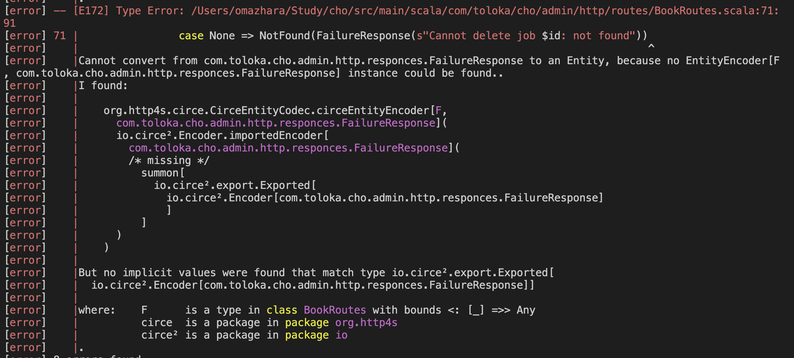

# Course

[rockthejvm.com](https://rockthejvm.com/).

### 21/08
#### Here we are

12. Testing jobs 

#### How to

- using docker containers for tests
- we need spin transactor every time as all test should work in separete env

### 06/08
#### Here we are

11. Testing jobs http api

#### How to

~Test/compile

### 06/08
#### Here we are

11. Adding DB configuration

### 05/08
#### Here we are

9. Put together routes and database
10. Add main file to config

#### How to
docker exec -it cho-db-1 psql -U docker  
\c library
"You are now connected to database "library" as user "docker" 

% sbt run  

sql:  select * from books;
#### Difficulties
restart and run

http: error: ConnectionError: HTTPConnectionPool(host='localhost', port=4041): Max retries exceeded with url: /api/books/create/ (Caused by NewConnectionError('<urllib3.connection.HTTPConnection object at 0x102a13710>: Failed to establish a new connection: [Errno 61] Connection refused')) while doing a POST request to URL: http://localhost:4041/api/books/create/

### 17/07
#### Here we are

6. Book endpoints implementation 
7. Tests them in playground
8. Init test DB

#### How to
run
docker-compose up
sbt "runMain com.toloka.cho.admin.palyground.BooksPlayground"

#### Difficulties
1. SQL error fixing my be difficult because unclear error message

### 15/07

#### Here we are

6. Book endpoints implementation with mocked DB
7. Logger

#### How to

if you miss DB - create Map and pretend you have db, same for other things you can abstract

new terminal -> http get localhost:4041/api/books/create < /Users/omazhara/Study/cho/examplePayloads/bookinfo.json

#### Difficulties

1. Imports 
import org.http4s.circe.CirceEntityCodec.*
|Cannot convert from com.toloka.cho.admin.http.responces.FailureResponse to an Entity, because no EntityEncoder[F, com.toloka.cho.admin.http.responces.FailureResponse] instance could be found..

try import
 import io.circe.generic.auto.*

[error] -- [E008] Not Found Error: /Users/omazhara/Study/cho/src/main/scala/com/toloka/cho/admin/http/routes/BookRoutes.scala:14:10 
[error] 14 |import io.circe.generic.auto.*
[error]    |       ^^^^^^^^
[error]    |value circe is not a member of object org.http4s.dsl.io - did you mean io.clone?
[error] one error found
[error] (Compile / compileIncremental) Compilation failed
[error] Total time: 2 s, completed Jul 15, 2024 3:31:25 PM
[info] 19. Monitoring source files for server/compile...

import io.circe.generic.auto.* - import it on very top to avoid error

### 14/07

#### Here we are

1. Backend project set up
    1) Visual studio + Metals
    2) Doobie, Http4s
2. Add a health endpoint
3. Add minimal configuration
4. Create basic http server layout
5. Book endpoints 

#### How to
0. check this one for inspiration [full-stack-typelevel-demo](https://github.com/rockthejvm/full-stack-typelevel-demo)
1. if you need something from cats or cats effects - import *, you will never remember, where this classes located
2. to make project constantly compile after save in VS
    new terminal -> sbt -> ~compile
   to run 
    new terminal -> sbt -> runMain com.toloka.cho.admin.Application
    or sbt "runMain com.toloka.cho.admin.Application"
   to make some requests
    new terminal -> http get localhost:8080/health

import pureconfig.generic.derivation.default.* to be able to derive ConfigReader

#### Difficulties

1. Which dev env choose
2. Tecnology stack?
3. How do I run this locally to check? 
4. How to structure project
5. How to create endpoint, how pass parameters

