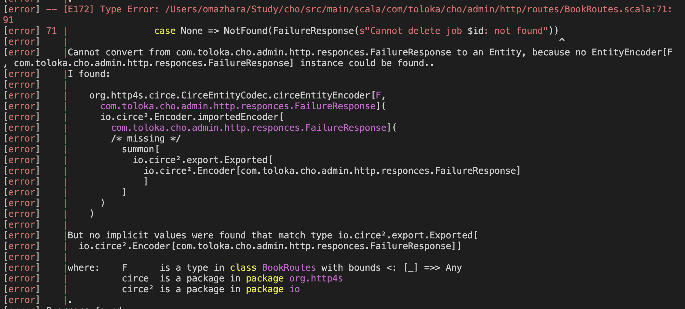

# Course

[rockthejvm.com](https://rockthejvm.com/).

### 15/09
#### Fronend, change project structure

20.

#### How to
https://blog.rockthejvm.com/full-stack-typelevel/
reload, run server
npm install
cd app -> npm run start
 sbt -> ~ ;fastOptJS

We need the database to be running, so make sure you have it active or run docker-compose up in the db directory.
We need the Application in the server module to run, which you can start either in IntelliJ/Metals or in SBT.
We need to compile the frontend, so open an SBT console, run project app, then run ~fastOptJS to continuously compile the Scala code to JS.
We need to serve the resulting HTML and JS, so in the root of the app directory, run npm run start
After this, navigate to http://localhost:1234 and you should see the list of all the jobs in the database displayed on the front page. True, they’re just regular strings, but you can now show them with any sort of fancy UIs, with nice layouts and CSS.

### 15/09
#### Password recovery

19. Password recovery

#### How to 

token generation mechanism
email recovery service

javax.mail
https://ethereal.email/
mailgone

### 26/08
#### Here we are

17. Role Base access control

#### How to

### 23/08
#### Here we are

Users
    - regular crud
Authentification
    - email/password
    - password hashing
    password recovery via email
Autherisation
    -JWT
    -authenticated endpoints
    -role-based endpoints access control

15. Users Managment
16. Authentification

#### How to 

https://jmcardon.github.io/tsec/
how hashing passwords look like - PasswordHashingPlayground -> BCrypt
traverse 
later - password recovery via email

TSec is a robust library, but has not been in active development recently. Http4s also has built-in authenticated routes, but the implementation of JWT authorization (and later RBAC) still needs our work, so we need either

a library that fits in well with Http4s, or
manual labor to manage tokens (and roles, later) ourselves
If TSec becomes deprecated or defunct, we'll change the implementation here with minimal impact to the auth code.

### 21/08
#### Here we are

12. Testing jobs
13. Http payload validation
14. Pagination and filtering

#### How to

- using docker containers for tests
- we need spin transactor every time as all test should work in separete env
- refined will not be used because:
        check at compile time - increase compile time
        lowers DX "coerce"
- we will use extention method for validation

source "$HOME/.sdkman/bin/sdkman-init.sh"
sdk use java 17.0.11-zulu

### 06/08
#### Here we are

11. Testing jobs http api

#### How to

~Test/compile

### 06/08
#### Here we are
11. Adding DB configuration

### 05/08
#### Here we are

9. Put together routes and database
10. Add main file to config

#### How to
docker exec -it cho-db-1 psql -U docker
\c library
"You are now connected to database "library" as user "docker" 

% sbt run

sql:  select * from books;
#### Difficulties
restart and run

http: error: ConnectionError: HTTPConnectionPool(host='localhost', port=4041): Max retries exceeded with url: /api/books/create/ (Caused by NewConnectionError('<urllib3.connection.HTTPConnection object at 0x102a13710>: Failed to establish a new connection: [Errno 61] Connection refused')) while doing a POST request to URL: http://localhost:4041/api/books/create/

### 17/07
#### Here we are

6. Book endpoints implementation
7. Tests them in playground
8. Init test DB

#### How to
run
docker-compose up
sbt "runMain com.toloka.cho.admin.palyground.BooksPlayground"

#### Difficulties
1. SQL error fixing can be difficult because unclear error message

### 15/07

#### Here we are

6. Book endpoints implementation with mocked DB
7. Logger

#### How to

if you miss DB - create Map and pretend you have db, same for other things you can abstract

new terminal -> http get localhost:4041/api/books/create < /Users/omazhara/Study/cho/examplePayloads/bookinfo.json

#### Difficulties

1. Imports 
import org.http4s.circe.CirceEntityCodec.*
|Cannot convert from com.toloka.cho.admin.http.responces.FailureResponse to an Entity, because no EntityEncoder[F, com.toloka.cho.admin.http.responces.FailureResponse] instance could be found..

try import
 import io.circe.generic.auto.*

[error] -- [E008] Not Found Error: /Users/omazhara/Study/cho/src/main/scala/com/toloka/cho/admin/http/routes/BookRoutes.scala:14:10 
[error] 14 |import io.circe.generic.auto.*
[error]    |       ^^^^^^^^
[error]    |value circe is not a member of object org.http4s.dsl.io - did you mean io.clone?
[error] one error found
[error] (Compile / compileIncremental) Compilation failed
[error] Total time: 2 s, completed Jul 15, 2024 3:31:25 PM
[info] 19. Monitoring source files for server/compile...

import io.circe.generic.auto.* - import it on very top to avoid error

### 14/07

#### Here we are

1. Backend project set up
    1) Visual studio + Metals
    2) Doobie, Http4s
2. Add a health endpoint
3. Add minimal configuration
4. Create basic http server layout
5. Book endpoints 

#### How to
0. check this one for inspiration [full-stack-typelevel-demo](https://github.com/rockthejvm/full-stack-typelevel-demo)
1. if you need something from cats or cats effects - import *, you will never remember, where this classes located
2. to make project constantly compile after save in VS
    new terminal -> sbt -> ~compile
   to run 
    new terminal -> sbt -> runMain com.toloka.cho.admin.Application
    or sbt "runMain com.toloka.cho.admin.Application"
   to make some requests
    new terminal -> http get localhost:8080/health

import pureconfig.generic.derivation.default.* to be able to derive ConfigReader

#### Difficulties

1. Which dev env choose
2. Tecnology stack?
3. How do I run this locally to check? 
4. How to structure project
5. How to create endpoint, how pass parameters

